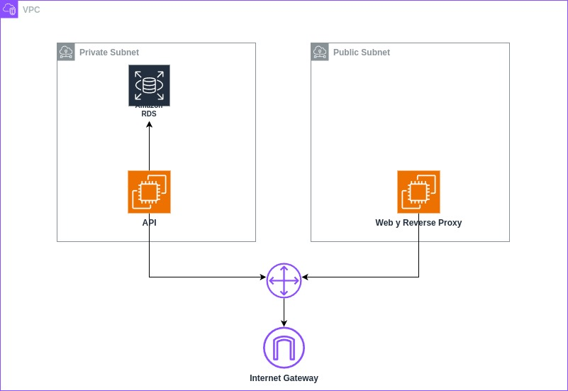

# My DevOps World

The objective of this repository is to provide a basic infrastructure template written in Terraform to create and manage
AWS resources programmatically.

The AWS resources available in this repository are:
- Networking resources.
- EC2 instance.
- RDS instance for the database.

A graphic representation of it ie the following diagram:



## Structure of the project

-  `main.tf`: Main terraform module with the declaration of all the resources required for basic infrastructure.
- `modules`: a folder that contains the module definitions used in the template. The available modules are:
  - `ec2-linux`: Module that creates an EC2 instance
  - `network`: Module that creates all the networking resources required to deploy infrastructure with a EC2 machine with exposition to the internet. The created resources include:
    - A VPC
    - A public subnet
    - A security group with the rules to open ports 443, 80 and 22 to the whole world
    - The API gateway and the route tables required to expose the previous subnet to the internet
  -  `rds`: Module that creates a database in RDS
-  `create_machine_script.tmpl`: File with an init script example used in the EC2 machine initialization
-  `outputs.tf`: Definition of the main modules outputs values
-  `variables.tf`: File to declare the variables used by the main module.
-  `provider.tf`: File to configure the terraform provider

## Get Started

### Pre-requisites

[Install LocalStack](https://docs.localstack.cloud/getting-started/installation/)

[Install tflocal (Terraform for LocalStack)](https://github.com/localstack/terraform-local)

[Install awslocal (AWSCli for LocalStack)](https://github.com/localstack/awscli-local)


### Providers file

**region=** The region where we are going to work. You have to put the value directly as the "provider" block doesn't allow variables.


### Init

In order to initialize your repo, please run the following command (Make sure you have LocalStack up and running)
```bash
tflocal init
tflocal validate
tflocal apply
```
